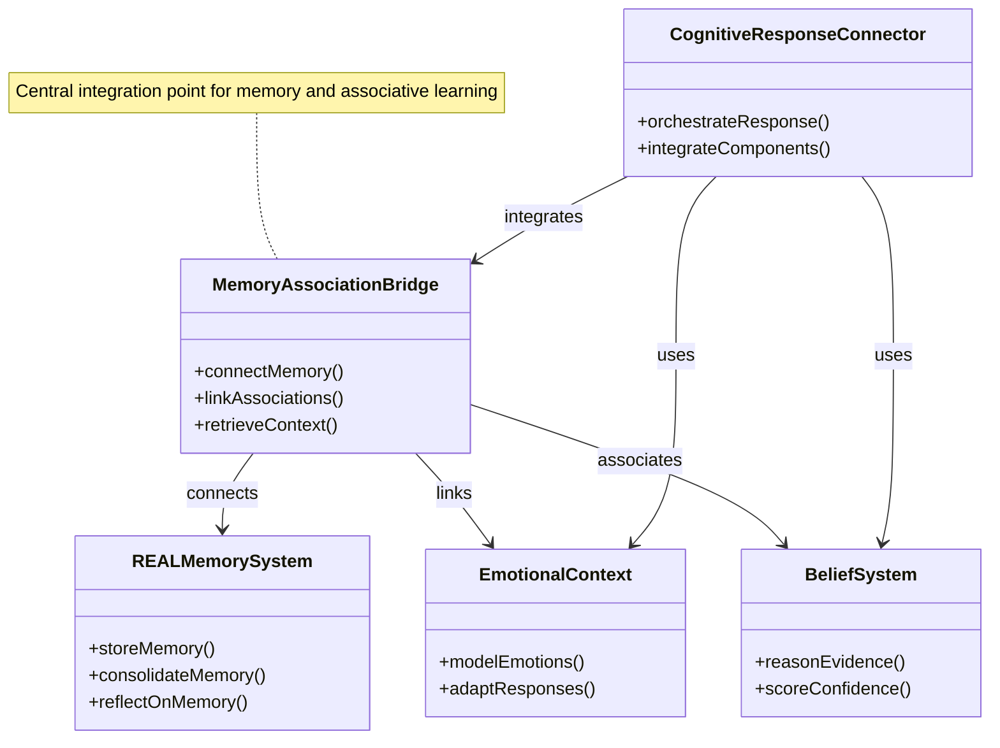
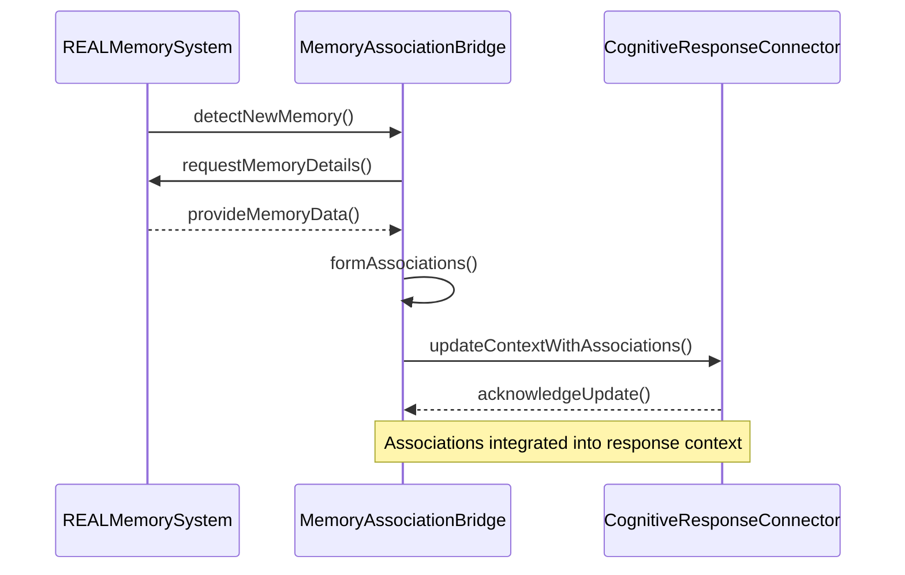

# Kor'tana System Architecture Blueprint

## Vision

Kor'tana is an autonomous intelligence system designed to evolve through continuous learning, self-reflection, and adaptive reasoning. The system combines cognitive architecture with modular design to create a responsive and growing intelligence capable of understanding context, building relationships, and improving over time.

## Core Architectural Components

### 1. R.E.A.L. Memory System (Responsive, Evolving, Adaptive, Learning)

- **Memory Reflection**: Self-analysis capabilities through pattern recognition ✅
- **Memory Consolidation**: Transfer from short-term to long-term storage based on importance ✅
- **User Memory Enhancement**: Personalized user profiling and relationship evolution ✅
- **Belief System**: Evidence-based reasoning with confidence scoring ✅
- **Emotional Context**: Multi-dimensional emotional modeling with adaptive responses ✅
- **Associative Learning**: Pattern detection and concept linking across experiences ✅

### 2. Cognitive Integration Architecture

- **CognitiveResponseConnector**: Central orchestration of memory, emotions, beliefs and associations ✅
- **Context Generation**: Weighted integration of cognitive components for response ✅
- **Adaptive Learning**: Automatic adjustment of weights based on feedback ✅
- **Memory-Association Bridge**: Seamless integration between memory and associative learning ✅
  - Bridge successfully implemented and integrated with CognitiveResponseConnector ✅
  - Unit tests passing (10/12 core tests) ✅
  - Advanced features (decay, edge cases) need refinement 🔄
- **Production Monitoring**: Real-time cognitive state visualization and metrics 🔄

#### Component Diagrams

To enhance understanding of the Cognitive Integration Architecture, the following UML diagram illustrates the connections between key components, with a focus on the Memory-Association Bridge:



Additionally, a sequence diagram for memory consolidation and association formation processes:



### 3. Autonomous Development System

- **Autonomous Validation Framework**: Complete 4-phase self-assessment and correction system ✅
  - **Phase 1: Core Validation Engine** - System health validation, response chain validation, cognitive drift detection ✅
  - **Phase 2: Cognitive Feedback Loops** - Real-time performance monitoring, automatic trigger detection, self-correction mechanisms ✅
  - **Phase 3: Advanced Learning Algorithms** - ML-based parameter optimization, predictive corrections, cross-component learning 🔄
  - **Phase 4: Autonomous Intelligence** - Self-directed capability enhancement, autonomous goal setting, intelligent self-modification 📋
- **Cognitive Feedback System**: Real-time performance monitoring with adaptive correction loops ✅
- **Production Monitoring**: Comprehensive system health tracking with alerting and dashboards ✅
- **Self-Validation**: Automated testing of cognitive coherence ✅
- **Goal Generation**: Autonomous identification of improvement opportunities ✅
- **Code Evolution**: Self-directed enhancement of capabilities 🔄
- **Performance Analysis**: Continuous monitoring and optimization ✅
- **Self-reflection capability**: ✅
- **Learning from interaction patterns**: ✅
- **Memory-guided response improvement**: ✅
- **Knowledge expansion system**: 🔄
- **Code generation and self-modification**: 🔄
- **Autonomous skill acquisition**: 📋
- **Error detection and self-correction**: ✅

- **Self-Awareness Integration Patterns**: ✅
  - **Presence Agent Implementation**: A dedicated agent that maintains system self-awareness through continuous monitoring of system health, goal management, and learning pattern analysis. This agent integrates with core systems to provide real-time insights and predictive decision-making capabilities. ✅
  - **Feedback Loop Integration**: Self-awareness data is fed into cognitive feedback loops to enable adaptive correction and performance optimization, ensuring the system remains aligned with its objectives. ✅
  - **Goal Processing Connectivity**: The Presence Agent connects with the goal processing pipeline to autonomously adjust priorities and strategies based on system state and environmental factors. 🔄
  - **Execution Planning Coordination**: Integration with execution planning systems to ensure self-aware decisions influence task prioritization and resource allocation. 🔄

## Technical Implementation Status

### Completed Components

- ✅ Basic Memory System
- ✅ Reflection Module
- ✅ Consolidation System
- ✅ CognitiveResponseConnector with Enhanced Integration
- ✅ Belief System
- ✅ Emotional Context Modeling
- ✅ Association Engine
- ✅ Enhanced Response Quality Integration
- ✅ **Memory-Association Bridge** - Complete integration with async support and validation
- ✅ **Autonomous Validation Framework Phase 1** - Core validation engine with system health monitoring
- ✅ **Autonomous Validation Framework Phase 2** - Cognitive feedback loops and self-correction mechanisms
- ✅ **Production Monitoring System** - Comprehensive health tracking with real-time metrics
- ✅ **Adaptive Quality Optimizer** - Real-time response enhancement with learning capabilities
- ✅ **Validation Metrics Collection** - Complete metrics framework with trend analysis
- ✅ **CLI Interface** - Command-line tool for memory management and system interaction
- ✅ **REST API Service** - FastAPI server with memory and association endpoints
- ✅ **Public API Integration** - No-auth APIs for weather, holidays, news, books with full UI integration

### In Progress

- 🔄 **Autonomous Validation Framework Phase 3** - Advanced learning algorithms and predictive corrections
- 🔄 **Environment Standardization (Python 3.11+)**
- 🔄 **Advanced User Modeling Integration**
- 🔄 **Expand Integration & Validation Tests and Baseline Establishment**
- 🔄 **Scheduler Integration & Validation Testing** - Finalize and validate scheduler integration, periodic ADE cycles, and environmental scans
- 🔄 **Autonomous Goal Generation Framework** - Implement autonomous goal creation, prioritization, and execution
- 🔄 **Advanced Learning Integration** - Integrate memory optimization with adaptive learning modules
- 🔄 **Autonomous Development Engine (ADE)** - Build and integrate the autonomous development agent using OpenAI primitives and Sacred Covenant
- 🔄 **CLI Interface Implementation** - Command-line tool for memory management, association, and testing ✅ COMPLETED
- 🔄 **REST API Service Development** - FastAPI server exposing memory and association endpoints ✅ COMPLETED
- 🔄 **Dev/Test Requirements Consolidation** - Separate dev dependencies into a dedicated dev-requirements.txt ✅ COMPLETED
- 🔄 **VS Code Task Automation** - Added tasks for API server and CLI test execution ✅ COMPLETED
- 🔄 **Public API Integration** - No-auth APIs for weather, holidays, news, books with adapters, proxy, and UI cards ✅ COMPLETED

## Next Phase: Autonomous AI Coding Assistance

- Scaffold Git integration using GitPython to automate branch creation, commits, and pull requests.
- Expand analysis engine to detect a wider range of code issues (unused imports, long functions, code smells).
- Implement patch dry-run sandbox to validate proposed changes without altering source.
- Build feedback loop and metrics logging for patch acceptance and rejection rates.
- Integrate with CI/CD to automatically run autonomous cycle on new PRs and generate improvement suggestions.
- Explore human-in-the-loop review workflows for high-risk changes.

---

## Hybrid Local ↔ Cloud Integration (Draft Overview)

This section summarizes the emerging design for connecting local Kor'tana runtimes (developer or edge nodes) with the centralized cloud orchestration layer. A full, living specification is maintained in `HYBRID_INTEGRATION_BLUEPRINT.md`.

### Goals
1. Secure, revocable identity for each local node (no long‑lived broad keys locally).
2. Delegated, short‑lived capability tokens for model execution & state sync.
3. Bidirectional state synchronization (events + mutable prefs) with conflict safety.
4. Graceful offline operation and later reconciliation (append‑only events + vector‑clock merges where needed).
5. Cloud-governed routing (multi‑LLM provider selection) with locally cached manifests.
6. Observability & cost attribution without leaking raw sensitive content.

### Core Artifacts
- **Enrollment Bundle**: Signed device identity (Ed25519 public key, scopes, expiry).
- **Capability Token (5–15m TTL)**: Narrow-scoped signed token (exec/sync permissions, route hints).
- **Routing Manifest (≈30–60m TTL)**: Cached model/provider fallback + policy guardrails.
- **Event Batches**: Append-only logs (conversation events, tool invocations, summaries lineage).

### Key Endpoints (Initial Slice)
`POST /v1/auth/enroll` – One-time device enrollment (admin-approved).
`POST /v1/auth/capability` – Issue short-lived capability token (signed challenge).
`GET  /v1/auth/revocations` – Signed revocation digest (device & token jti invalidations).
`POST /v1/sync/submit` – Push batched immutable events + mutable preference patches.
`GET  /v1/sync/pull` – Incremental pull (cursor-based).
`POST /v1/execute/model` – Delegated model invocation (cloud-managed routing).

### Conflict Strategy
- **Immutable Streams**: Conversation/tool events: append-only (hash + monotonic local seq).
- **Mutable Docs (prefs)**: Vector clock (device_id, counter) + last-write-wins fallback + optional semantic merge hook.
- **Derived Artifacts (summaries)**: Recompute if divergent; no merge complexity.

### Offline / Resilience
- Local queue (SQLite WAL) collects events; capability tokens expire → degrade to local-only mode.
- On reconnect: re-enrollment check (if near expiry), new capability, flush batches, pull remote diff.

### Security Highlights
- No upstream provider master keys stored locally.
- Short-lived capability tokens (signed, stateless verification) limit blast radius.
- Optional mTLS layer for production edge (Phase 5).
- Revocation list polling (5–10m) + forced 401 on invalidated devices.

### Telemetry Envelope (Minimal)
```
{
    trace_id, device_id, cap_jti, op, model, tokens_in, tokens_out,
    latency_ms, policy_route, ts, status, cost_estimate_usd
}
```
Redaction: hash(prompt) with rotating salt unless audit=true.

### Rollout Phases
1. Enrollment + capability issuance + model exec.
2. Append-only sync (submit/pull) for conversation events.
3. Preferences with vector clocks + conflict merges.
4. Routing manifest caching + offline degrade.
5. mTLS + revocation digest hardening + structured telemetry.
6. Optional per-event MAC & encryption enhancements.

### Open Questions (Tracked)
- Maximum expected batch size & need for chunk streaming.
- Multi-tenant isolation boundaries (future: per-tenant key derivation?).
- On-device lightweight inference inclusion (affects routing manifest semantics).

For full details (token schema, endpoint request/response, threat model) see `HYBRID_INTEGRATION_BLUEPRINT.md` and the OpenAPI seed: `specs/hybrid-auth-sync.openapi.yaml`.

---
