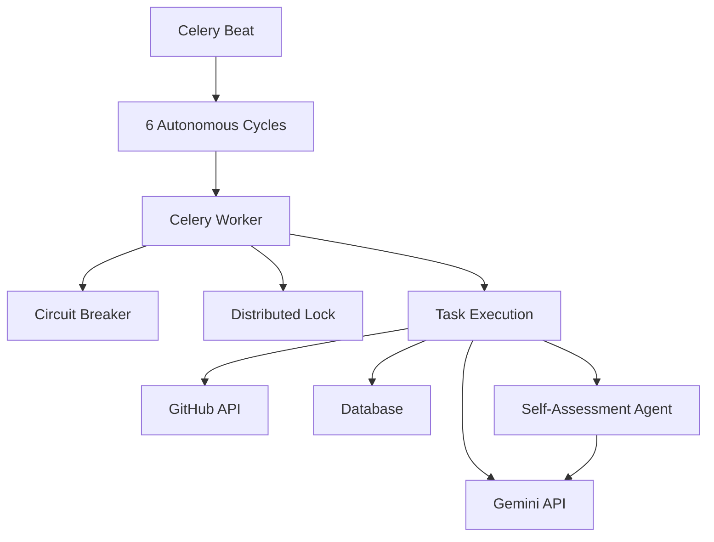

# Kor'tana Autonomy & Self-Awareness Architecture Analysis

## 1. Executive Summary
Kor'tana's autonomy system is a robust, Celery-based architecture designed for continuous operation. While the core logic is functional and enabled, several bottlenecks and limitations exist that could hinder scalability and true self-awareness.

## 2. Current Architecture Overview
The system relies on a scheduled loop of six autonomous cycles triggered by Celery Beat and executed by Celery workers.

## 3. Bottlenecks & Limitations

### A. External API Dependencies
- **Gemini API:** High latency and potential rate limits for frequent autonomous cycles.
- **GitHub API:** Rate limits for monitoring and PR creation.

### B. Data Persistence & State
- **In-Memory Metrics:** `AutonomousSystemMonitor` stores metrics in-memory, leading to data loss on worker restarts.
- **Database Concurrency:** Potential limitations with SQLite for high-concurrency task management.

### C. Self-Awareness & Learning
- **Static Assessment:** The `SelfAssessmentAgent` uses static prompts and rubrics, lacking true learning from past assessments.
- **Parsing Fragility:** Basic JSON extraction from Gemini responses is prone to failure if the model output format deviates.

### D. Workflow Execution
- **Redis Dependency:** Workflow state and dependency management rely heavily on Redis; downtime or latency here impacts all autonomous workflows.
- **Locking Overhead:** `DistributedLock` on workflow execution may limit concurrency.

## 4. Recommendations for Enhancement

### A. Scalability & Reliability
- **Persistent Metrics:** Migrate `AutonomousSystemMonitor` metrics to a persistent database (e.g., PostgreSQL) to ensure data survival across restarts.
- **API Caching:** Implement aggressive caching for GitHub and Gemini API responses to reduce rate limit pressure and latency.

### B. Self-Awareness & Learning
- **Dynamic Assessment:** Evolve the `SelfAssessmentAgent` to maintain a history of assessments and learn from past successes/failures (e.g., fine-tuning or RAG on past assessments).
- **Robust Parsing:** Implement structured output enforcement (e.g., Pydantic models with Gemini's JSON mode) to ensure reliable parsing of AI responses.

### C. Workflow Optimization
- **Locking Granularity:** Review `DistributedLock` usage to ensure it is not unnecessarily blocking parallel workflows.
- **Task Batching:** Optimize task batching to reduce Celery overhead for small, frequent tasks.
