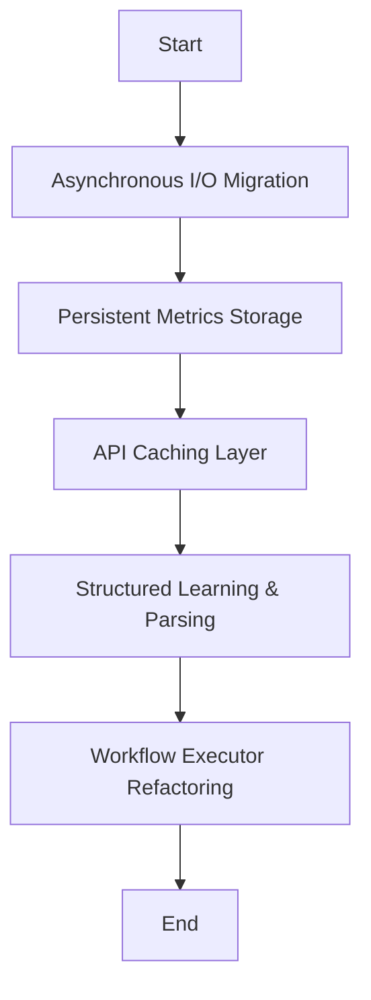

# Kor'tana Autonomy Optimization Plan

## 1. Executive Summary
This plan outlines the prioritized optimizations for Kor'tana's autonomy and self-awareness systems, based on the findings from the `AUTONOMY_ARCHITECTURE_ANALYSIS.md` and `AUTONOMY_CODE_AUDIT.md`.

## 2. Prioritized Optimization Opportunities

| Priority | Optimization | Justification | Estimated Impact |
| :--- | :--- | :--- | :--- |
| 1 | Asynchronous I/O Migration | Eliminates blocking I/O, enabling true concurrency and preventing event loop starvation. | High (Performance, Scalability) |
| 2 | Persistent Metrics Storage | Ensures performance metrics survive worker restarts, enabling long-term trend analysis. | High (Self-Awareness, Reliability) |
| 3 | API Caching Layer | Reduces rate limit pressure and latency for GitHub and Gemini API calls. | Medium (Reliability, Performance) |
| 4 | Structured Learning & Parsing | Improves reliability of self-assessment and enables learning from past assessments. | Medium (Self-Awareness) |
| 5 | Workflow Executor Refactoring | Reduces overhead and improves reliability of workflow execution. | Low (Performance, Reliability) |

## 3. Implementation Roadmap

